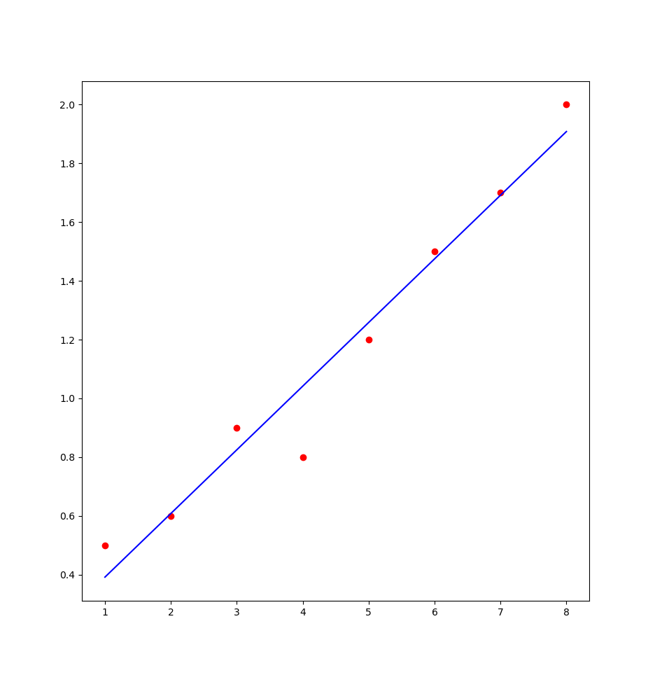

# least-squares
Least-squares is a method for deriving an equation that approximates n-points.
The current implementation finds an equation in the form `f(x) = a₀ + a₁·x`, given a list of x points and y points.

## Method
Given points `(xᵢ, yᵢ)`, the coefficients are:

- a₁ = (n·Σxy - Σx·Σy) / (n·Σx² - (Σx)²)
- a₀ = (Σx²·Σy - Σx·Σxy) / (n·Σx² - (Σx)²)

where n is the length of the x list.

## Results
For `xs = [1..8]` and `ys = [0.5, 0.6, 0.9, 0.8, 1.2, 1.5, 1.7, 2.0]`:

- `a₀ = 0.175`
- `a₁ = 0.2167`
- `SSE = 0.0883`



## Dependencies
```bash
pip install matplotlib scipy numpy
cabal update
cabal install matplotlib
```

## Running
```bash
cabal build
cabal run
```
